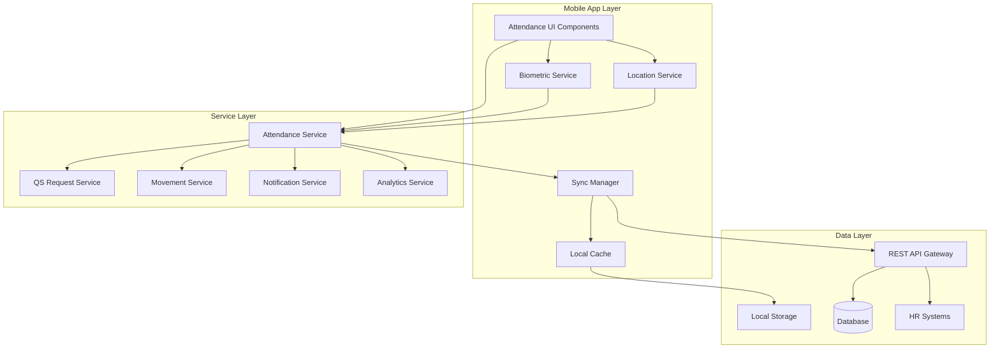

# Design Document: Attendance Enhancements

## Overview

The attendance enhancements will transform the existing FakirPay attendance system into a comprehensive, intelligent, and user-friendly solution. The design focuses on improving reliability through multiple location detection methods, adding biometric security, enabling offline functionality, and providing advanced analytics and administrative controls.

The system will maintain backward compatibility with the existing attendance infrastructure while introducing new capabilities that enhance both employee experience and administrative efficiency.

## Architecture

### High-Level Architecture



### Component Architecture

The system follows a modular architecture with clear separation of concerns:

- **Presentation Layer**: React Native components for user interface
- **Business Logic Layer**: Services handling attendance rules and workflows
- **Data Access Layer**: Abstraction over local and remote data sources
- **Integration Layer**: APIs for external system communication

## Components and Interfaces

### Location Service Enhanced

**Purpose**: Provide reliable location detection using multiple methods

**Key Features**:
- GPS with fallback to WiFi and Bluetooth beacons
- Geofence validation with configurable boundaries
- Location caching for signal loss scenarios
- Battery-optimized location tracking

**Implementation Approach**:
Based on research, we'll use `react-native-geolocation-service` for primary GPS functionality and `react-native-background-geolocation` for advanced geofencing capabilities. The service will implement a hierarchical location detection strategy:

1. Primary: High-accuracy GPS
2. Secondary: Network-based location (WiFi)
3. Tertiary: Bluetooth beacon proximity
4. Fallback: Cached last known location (5-minute validity)

**Interface**:
```typescript
interface LocationService {
  getCurrentLocation(): Promise<LocationResult>
  isWithinGeofence(location: Coordinates): boolean
  startLocationTracking(): void
  stopLocationTracking(): void
  getCachedLocation(): LocationResult | null
}
```

### Biometric Authentication Service

**Purpose**: Secure attendance recording using biometric data

**Key Features**:
- Fingerprint and Face ID support
- Secure biometric template storage
- Fallback authentication methods
- Anti-spoofing measures

**Implementation Approach**:
Research indicates `react-native-biometrics` as the most reliable library for cross-platform biometric authentication. The service will implement device-level encryption for biometric templates and provide graceful fallbacks.

**Interface**:
```typescript
interface BiometricService {
  isAvailable(): Promise<BiometricType[]>
  authenticate(reason: string): Promise<AuthResult>
  enrollBiometric(): Promise<EnrollmentResult>
  removeBiometric(): Promise<boolean>
}
```

### Offline Data Manager

**Purpose**: Handle attendance data when network connectivity is unavailable

**Key Features**:
- Local data persistence using SQLite
- Automatic sync when connectivity restored
- Conflict resolution strategies
- Data integrity validation

**Implementation Approach**:
Based on research findings, we'll use SQLite for structured offline storage with AsyncStorage for simple key-value caching. The system will implement a queue-based sync mechanism with exponential backoff for failed sync attempts.

**Interface**:
```typescript
interface OfflineDataManager {
  storeAttendanceRecord(record: AttendanceRecord): Promise<void>
  getPendingSyncRecords(): Promise<AttendanceRecord[]>
  syncWithServer(): Promise<SyncResult>
  resolveConflict(conflict: DataConflict): Promise<void>
}
```

### Enhanced QS Request Manager

**Purpose**: Advanced QS request handling with document attachments and workflow routing

**Key Features**:
- Document attachment support
- Automated approval routing
- Real-time status tracking
- Audit trail maintenance

**Interface**:
```typescript
interface QSRequestManager {
  createRequest(request: QSRequest): Promise<string>
  attachDocument(requestId: string, document: Document): Promise<void>
  getRequestStatus(requestId: string): Promise<RequestStatus>
  getApprovalWorkflow(requestId: string): Promise<WorkflowStep[]>
}
```

### Smart Movement Register

**Purpose**: Intelligent movement tracking with route validation and automatic calculations

**Key Features**:
- Destination suggestions based on history
- Real-time route tracking
- Travel time calculations
- Deviation alerts

**Interface**:
```typescript
interface MovementRegister {
  createMovementRequest(request: MovementRequest): Promise<string>
  trackMovement(requestId: string): Promise<void>
  calculateTravelTime(origin: Location, destination: Location): Promise<number>
  validateRoute(requestId: string, currentLocation: Location): Promise<ValidationResult>
}
```

## Data Models

### Enhanced Attendance Record

```typescript
interface AttendanceRecord {
  id: string
  employeeId: string
  date: Date
  clockInTime?: Date
  clockOutTime?: Date
  location: LocationData
  authenticationType: 'biometric' | 'pin' | 'manual'
  status: 'present' | 'absent' | 'late' | 'early_departure'
  workingHours?: number
  isOfflineRecord: boolean
  syncStatus: 'synced' | 'pending' | 'failed'
  metadata: {
    deviceId: string
    appVersion: string
    locationAccuracy: number
    biometricType?: string
  }
}
```

### Location Data

```typescript
interface LocationData {
  coordinates: {
    latitude: number
    longitude: number
  }
  accuracy: number
  timestamp: Date
  source: 'gps' | 'network' | 'beacon' | 'cached'
  isWithinGeofence: boolean
  distanceFromCenter?: number
}
```

### QS Request Enhanced

```typescript
interface QSRequest {
  id: string
  employeeId: string
  type: 'attendance_correction' | 'time_adjustment' | 'manual_entry'
  requestDate: Date
  targetDate: Date
  originalClockIn?: Date
  originalClockOut?: Date
  requestedClockIn?: Date
  requestedClockOut?: Date
  reason: string
  attachments: Document[]
  status: 'pending' | 'approved' | 'rejected' | 'requires_info'
  workflowSteps: WorkflowStep[]
  auditTrail: AuditEntry[]
}
```

### Movement Request

```typescript
interface MovementRequest {
  id: string
  employeeId: string
  date: Date
  departureTime: Date
  expectedReturnTime: Date
  actualReturnTime?: Date
  destination: string
  purpose: string
  status: 'pending' | 'approved' | 'active' | 'completed' | 'overdue'
  route: RoutePoint[]
  estimatedTravelTime: number
  actualTravelTime?: number
}
```

Now I need to use the prework tool to analyze the acceptance criteria before writing the correctness properties:

## Correctness Properties

*A property is a characteristic or behavior that should hold true across all valid executions of a system—essentially, a formal statement about what the system should do. Properties serve as the bridge between human-readable specifications and machine-verifiable correctness guarantees.*

### Property 1: Geofence-based access control
*For any* employee and geofence configuration, clock-in/out operations should only be allowed when the employee's location is within the defined geofence boundaries
**Validates: Requirements 1.1**

### Property 2: Location service fallback hierarchy
*For any* location request when GPS is unavailable, the Location_Service should attempt alternative methods (WiFi, Bluetooth beacons) in the defined priority order
**Validates: Requirements 1.2**

### Property 3: Geofence violation error messaging
*For any* employee attempting to clock-in outside the geofence, the system should display an error message that includes the calculated distance from the geofence boundary
**Validates: Requirements 1.4**

### Property 4: Location caching temporal validity
*For any* valid location reading, the Location_Service should cache it and consider it valid for exactly 5 minutes before requiring a fresh reading
**Validates: Requirements 1.5**

### Property 5: Biometric authentication priority
*For any* device with available biometric hardware, the Attendance_System should offer biometric authentication as the primary method before other options
**Validates: Requirements 2.1**

### Property 6: Authentication method fallback
*For any* failed biometric authentication attempt, the system should automatically present PIN-based authentication as an alternative
**Validates: Requirements 2.2**

### Property 7: Account lockout on repeated failures
*For any* sequence of authentication attempts exceeding the failure threshold, the system should temporarily lock the account and send administrator notifications
**Validates: Requirements 2.3**

### Property 8: Biometric data encryption
*For any* biometric template stored by the system, it should be encrypted using device-level encryption and not accessible without proper authentication
**Validates: Requirements 2.4**

### Property 9: Offline attendance storage
*For any* attendance record created when network connectivity is unavailable, the system should store it locally and mark it for synchronization
**Validates: Requirements 3.1**

### Property 10: Automatic sync on connectivity restoration
*For any* set of pending offline records, when network connectivity is restored, the system should automatically attempt to sync all pending records with the server
**Validates: Requirements 3.2**

### Property 11: Offline record retention policy
*For any* offline attendance record, the system should maintain it locally for up to 7 days, after which it should require synchronization before allowing new offline records
**Validates: Requirements 3.4**

### Property 12: Offline mode indication
*For any* period when network connectivity is unavailable, the system should display a clear offline indicator to inform users of the current mode
**Validates: Requirements 3.5**

### Property 13: QS request document attachment
*For any* QS request submission, the system should allow attachment of supporting documents and maintain their association with the request throughout the workflow
**Validates: Requirements 4.1**

### Property 14: Automatic QS request routing
*For any* submitted QS request, the system should automatically route it to the appropriate approver based on the configured organizational hierarchy
**Validates: Requirements 4.2**

### Property 15: QS request notification delivery
*For any* QS request requiring additional information, the system should send notifications containing specific requirements to the requester
**Validates: Requirements 4.3**

### Property 16: QS request audit trail completeness
*For any* QS request modification or approval action, the system should create a complete audit trail entry with timestamp, actor, and change details
**Validates: Requirements 4.4**

### Property 17: QS request status notification
*For any* QS request approval or rejection, the system should send real-time notifications to the original requester
**Validates: Requirements 4.5**

### Property 18: Movement destination suggestions
*For any* movement register creation, the system should suggest destinations based on the user's historical destinations and commonly used locations
**Validates: Requirements 5.1**

### Property 19: Movement route tracking
*For any* active movement register, the Location_Service should track the actual route and compare it with the declared destination
**Validates: Requirements 5.2**

### Property 20: Route deviation alerting
*For any* employee movement that deviates significantly from the declared route, the system should send alerts to the designated supervisor
**Validates: Requirements 5.3**

### Property 21: Travel time calculation
*For any* movement request, the system should automatically calculate travel time based on real-time traffic data and route distance
**Validates: Requirements 5.4**

### Property 22: Movement expiration reminders
*For any* movement register approaching expiration, the system should send reminder notifications to return to premises
**Validates: Requirements 5.5**

### Property 23: Monthly attendance summary generation
*For any* employee and month, the system should generate an attendance summary displaying present/absent/late statistics
**Validates: Requirements 6.1**

### Property 24: Attendance trend visualization
*For any* employee, the system should display attendance trends over the past 6 months with visual charts
**Validates: Requirements 6.2**

### Property 25: Average working hours calculation
*For any* set of attendance records, the system should calculate and display the average daily working hours
**Validates: Requirements 6.3**

### Property 26: Attendance pattern analysis
*For any* attendance data indicating potential issues, the system should provide personalized recommendations for improvement
**Validates: Requirements 6.4**

### Property 27: Attendance data export functionality
*For any* attendance data set, the system should allow export in both PDF and Excel formats with complete data integrity
**Validates: Requirements 6.5**

### Property 28: Flexible schedule configuration
*For any* work schedule type (shifts, flexible hours, remote work), the Admin_Panel should allow configuration and enforcement
**Validates: Requirements 7.1**

### Property 29: Bulk QS request operations
*For any* set of QS requests, the Admin_Panel should provide bulk approval/rejection capabilities that process all selected requests
**Validates: Requirements 7.2**

### Property 30: Customizable attendance reporting
*For any* combination of filters and date ranges, the Admin_Panel should generate attendance reports with the specified criteria
**Validates: Requirements 7.3**

### Property 31: Policy violation detection
*For any* attendance record that violates configured policies, the Admin_Panel should automatically flag it for administrative review
**Validates: Requirements 7.4**

### Property 32: Administrative audit logging
*For any* administrative action performed through the Admin_Panel, the system should maintain comprehensive audit logs
**Validates: Requirements 7.5**

### Property 33: Clock-in reminder notifications
*For any* employee approaching their scheduled clock-in time, the system should send reminder notifications at the configured intervals
**Validates: Requirements 8.1**

### Property 34: QS request status change notifications
*For any* QS request status change, the system should send push notifications with relevant details to the requester
**Validates: Requirements 8.2**

### Property 35: Movement register expiration warnings
*For any* movement register approaching expiration, the system should send warning notifications to the employee
**Validates: Requirements 8.3**

### Property 36: Notification preference customization
*For any* user notification preference setting, the system should save and apply the preferences to all relevant notifications
**Validates: Requirements 8.4**

### Property 37: Critical issue escalation
*For any* critical attendance issue, the system should escalate notifications to supervisors according to the configured escalation rules
**Validates: Requirements 8.5**

### Property 38: HR system API integration
*For any* HR system request to the attendance API endpoints, the system should provide appropriate responses with correct data formatting
**Validates: Requirements 9.1**

### Property 39: Real-time payroll synchronization
*For any* attendance data change, the system should synchronize the updated information with connected payroll systems in real-time
**Validates: Requirements 9.2**

### Property 40: Leave balance integration
*For any* attendance record that affects leave balances, the system should automatically update the leave management system
**Validates: Requirements 9.3**

### Property 41: Cross-system data consistency
*For any* data operation across integrated systems, the system should maintain consistency and prevent data corruption
**Validates: Requirements 9.4**

### Property 42: Integration failure handling
*For any* integration failure, the system should log detailed error information and provide automatic retry mechanisms
**Validates: Requirements 9.5**

### Property 43: Data encryption compliance
*For any* attendance data, the system should encrypt it both in transit and at rest using industry-standard encryption methods
**Validates: Requirements 10.1**

### Property 44: Role-based access control
*For any* user attempting to access system features, the system should enforce role-based permissions and deny unauthorized access
**Validates: Requirements 10.2**

### Property 45: Access audit logging
*For any* system access attempt, the system should maintain detailed logs including user identity, timestamp, and accessed resources
**Validates: Requirements 10.3**

### Property 46: Suspicious activity lockout
*For any* detected suspicious activity pattern, the system should automatically lock affected accounts and alert administrators
**Validates: Requirements 10.4**

### Property 47: Data protection regulation compliance
*For any* data handling operation, the system should comply with applicable data protection regulations (GDPR, local privacy laws)
**Validates: Requirements 10.5**

## Error Handling

### Location Service Errors
- **GPS Unavailable**: Graceful fallback to alternative location methods
- **All Location Methods Failed**: Present manual override with supervisor approval workflow
- **Geofence Violation**: Clear error messaging with distance information and guidance
- **Location Cache Expired**: Automatic refresh attempt with user notification if unsuccessful

### Biometric Authentication Errors
- **Hardware Unavailable**: Automatic fallback to PIN authentication
- **Biometric Recognition Failed**: Retry option with fallback after configured attempts
- **Template Corruption**: Secure re-enrollment process initiation
- **Multiple Failed Attempts**: Account lockout with administrator notification

### Offline Mode Errors
- **Storage Full**: Prioritize critical records and prompt for sync
- **Sync Conflicts**: Present resolution options with clear conflict details
- **Data Corruption**: Validate data integrity and request re-entry if necessary
- **Extended Offline Period**: Enforce sync requirement after 7-day limit

### Integration Errors
- **API Failures**: Exponential backoff retry with error logging
- **Data Format Mismatches**: Validation and transformation with error reporting
- **Network Timeouts**: Graceful degradation with offline mode activation
- **Authentication Failures**: Token refresh with fallback to manual authentication

## Testing Strategy

### Dual Testing Approach

The attendance enhancement system will employ both unit testing and property-based testing to ensure comprehensive coverage and correctness validation.

**Unit Tests** will focus on:
- Specific examples of location calculations and geofence validations
- Biometric authentication flows with known inputs
- Offline data storage and retrieval scenarios
- QS request workflow state transitions
- Integration points with external systems
- Error conditions and edge cases

**Property-Based Tests** will validate:
- Universal properties that hold across all inputs (47 properties defined above)
- Location service behavior with randomized coordinates and geofence configurations
- Authentication flows with various biometric availability scenarios
- Offline sync behavior with different network connectivity patterns
- Data consistency across integrated systems with random data sets

### Property-Based Testing Configuration

- **Testing Framework**: We will use `fast-check` for TypeScript/React Native property-based testing
- **Test Iterations**: Minimum 100 iterations per property test to ensure comprehensive input coverage
- **Test Tagging**: Each property test will be tagged with the format: **Feature: attendance-enhancements, Property {number}: {property_text}**
- **Coverage Requirements**: Each of the 47 correctness properties must be implemented as a separate property-based test
- **Integration Testing**: Property tests will validate end-to-end workflows across multiple components

### Testing Implementation Guidelines

- Property tests will generate realistic test data including valid employee IDs, coordinates within reasonable geographic bounds, and realistic timestamps
- Mock external dependencies (GPS hardware, network connectivity, HR systems) to enable controlled testing scenarios
- Validate both positive and negative test cases for each property
- Ensure property tests can run in CI/CD environments without external dependencies
- Implement custom generators for complex data types like attendance records and movement requests